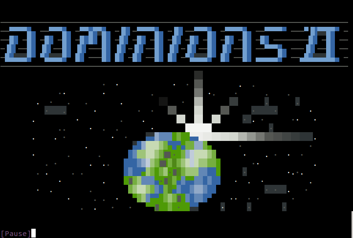

# Dominions

Dominions BBS Game with utility for running it without WWIV by Braddock Gaskill
(braddock@braddock.com), May 2017.  Thanks to Chris Lozaga for essential
assistance.



This repository contains a python script and configuration files for running
either the original Dominions or the Dominions ][ WWIV BBS Door Games.  It does
not require a WWIV BBS installation.

This repository also contains ported source code for Dominions version 1.41M
for the modern Free Pascal Compiler (fpc).  Source can be found in the `src/`
directory and should work on any platform with The Free Pascal Compiler (fpc)
(only tested on Linux).  Newer versions of Dominions and Dominions II are
provided without source code as DOS binaries in ZIP files in the `archive/`
directory (if anyone has the source code please contact us).

We are attempting to collect all surviving versions of the game.  If you have
one, please contact `braddock@braddock.com`

The `dominions.py` python command line interface provides a means to install a
new game, process turns, or log in as a user and run the game.  

`ansi2unicode` is a separate utility which converts ANSI graphics characters to
their Unicode UTF-8 equivalents, which allows the games to be played without
loading special VGA fonts or code tables.  It also interprets WWIV "heart code"
color encodings into standard ANSI color codes.

A Dockerfile is included for easily running an ssh game in a Docker container.

## The Many Dominions

Several versions of Dominions are included in ZIP files in the archive/ directory:

- **DOM140.ZIP** - v1.40, This is the last classic version of Dominions written
  entirely by Apocylypse (aka Chris Haisty).  This ZIP file includes source
code.  It is freeware that can be freely modified and distributed as long as no
fee is charged.

- **DOM141M.ZIP** - v1.41, This classic version of Dominions has the addition of Radar
  by Siroos Afshar.

- **DOM500.ZIP** - v5.00, is the Dominions game by Apocylypse (aka Chris Haisty), with
  modifications by Tarl Cabot, Siroos Afshar, and RiverCity.  It was written in
Turbo Pascal - unfortunately we have been unable to find the source for this
version.  This game is licensed as freeware as long as no money is charged for
distribution.

- **dom2v20b.zip** - Dominions II, v20 Beta, is the Beta release of Dominions
  II, a complete rewrite/reinvention of the Dominions game by Sean M. Baird in
C++.  It is distributed as shareware with a 21 day trial period, but we have
been unable to contact the original author.  The game does not seem to cease
after 21 days, so it is playable.

## Installation via Docker

Use the *VERSION* argument to specify which version.  *VERSION* should be one
of "141", "500", "2000".  VERSION=141 requires first building from source code (see
section COMPILING).

```bash
docker build --build-arg VERSION=2000 -t dominions2000 .
docker run -d -p 2222:22 --name dominions2000 dominions2000
ssh -p2222 dominions@localhost
# Default password is `conquest`
```

### Setting the nightly maintenance time

You probably want to set the time for nightly maintenance
to midnight local time.  You set it by editing gamedir/gamedb.json

Note that this time will be ignored by versions 141 and 140.

First open a bash shell into your container:

```bash
docker exec -i -t dominions2000 /bin/bash
vim gamedir/gamedb.json
```

Then edit next\_turn\_timestamp, which is in UTC.  
This example sets it to run at 7am UTC, which is midnight Pacific time.

```json
    "next_turn_timestamp": [
        2017,
        5,
        24,
        7,
        0,
        0,
        2,
        144,
        0
    ],
```

## Compiling

You only need to compile if you want to run the 1.41 version of Dominions, or
modify it youself.  Later version work with ZIPped binary DOS executables.

```
sudo apt-get install fpc
cd src/DOM141M
make
```

---
